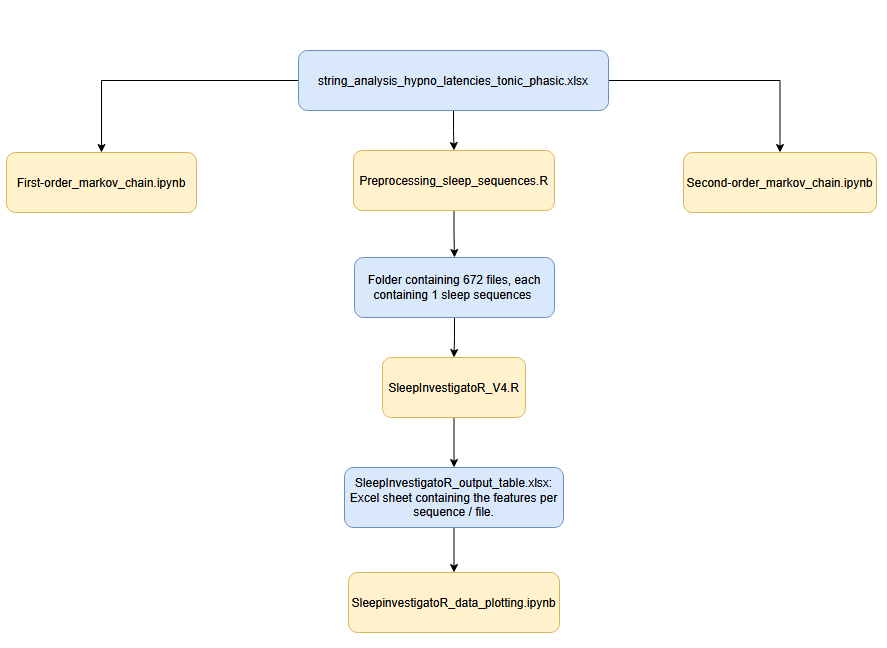

# SleepInvestigatoR Analysis

## Preprocessing
- **Performed by:** `preprocessing_sleep_sequences.R`
- **Processing script:**
  - **Input File:**  
    `string_analysis_hypno_latencies_tonic_phasic.xlsx`
  - **Functionality:**
    - Contains sleep sequences and other recording information.
    - Preprocesses the data.
    - Creates a separate file for each REM-included sequence.
    - Saves these files in a designated folder (path modifiable in the script).

## SleepInvestigatoR
- **Input:**
  - Location of the preprocessing script's output folder.
  - Update the filepath in the `SleepInvestigatoR` script.
- **Usage:**
  - Run the `SleepInvestigatoR` function in RStudio to initialize the variable.
  - Afterwards, call `SleepInvestigatoR` with the input on the next page of this document.
    - Set the `save_name` input variable as the desired output folder path.
  - `SleepInvestigatoR` processes each file and compiles a table of features.
- **Output:**
  - `SleepInvestigatoR_output_table.xlsx`

## Visualization
- **Performed by:** `SleepInvestigatoR_data_plotting.ipynb`
- **Input:**  
  `SleepInvestigatoR_output_table.xlsx`
- **Processing:**
  - Reads the file once and creates a dataframe of it.
  - Extracts necessary features for visualization per subscript.
- **Output:**
  - Print statements containing the statistical tests
  - Print statements containing the specific values
  - Visualizations of those values

---

# Markov Chain Analyses

## Input File
- `string_analysis_hypno_latencies_tonic_phasic.xlsx` (reused here)

## Scripts
- `First-order_markov_chain.ipynb`
- `Second-order_markov_chain.ipynb`

## Processing
- Each script reads the input file twice:
  - Once for REM sequences.
  - Once for Phasic, Tonic, and Intermediate sequences.
- Filepaths in the scripts need to be updated accordingly.

# Flowchart showing the data path

